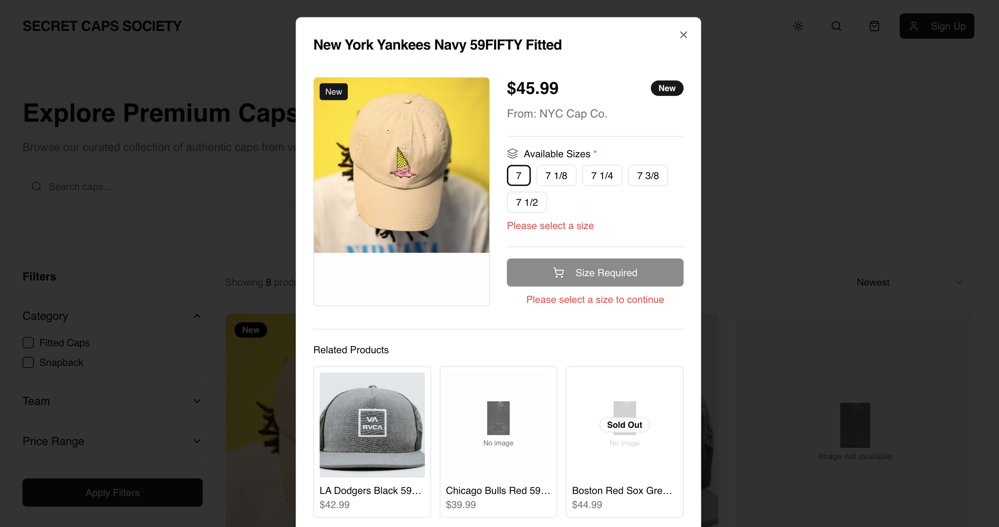

## Índice

0. [Ficha del proyecto](#0-ficha-del-proyecto)
1. [Descripción general del producto](#1-descripción-general-del-producto)
2. [Arquitectura del sistema](#2-arquitectura-del-sistema)
3. [Modelo de datos](#3-modelo-de-datos)
4. [Especificación de la API](#4-especificación-de-la-api)
5. [Historias de usuario](#5-historias-de-usuario)
6. [Tickets de trabajo](#6-tickets-de-trabajo)
7. [Pull requests](#7-pull-requests)

---

## 0. Ficha del proyecto

### \*\*0.1. Tu nombre completo:\*\* Francisco Eduardo Figueroa Mendoza

### \*\*0.2. Nombre del proyecto:\*\* The Secret Cap's Society

### \*\*0.3. Descripción breve del proyecto:\*\*

The Secret Caps Society es una plataforma exclusiva para revendedores de gorras, donde cada tienda puede registrarse y publicar sus productos de manera gratuita. Más que un marketplace, es una comunidad secreta para verdaderos coleccionistas y fanáticos, diseñada para conectar a los amantes de las caps con las piezas más buscadas del mercado.

Con un modelo innovador, la sociedad permite a los vendedores crecer sin costos iniciales, mientras que los compradores acceden a una selección única de gorras difíciles de encontrar. Nuestro objetivo es impulsar a los resellers y ofrecer a los fans un espacio confiable, seguro y auténtico para conseguir sus caps favoritas.

### **0.4. URL del proyecto:**

https://the-secret-caps-society.vercel.app/

### 0.5. URL o archivo comprimido del repositorio

https://github.com/Intense-Development/the-secret-caps-society

---

## 1. Descripción general del producto

> Describe en detalle los siguientes aspectos del producto:

### **1.1. Objetivo:**

Qué valor aporta

- Crea un espacio exclusivo y confiable donde revendedores de gorras pueden exhibir y vender sus productos sin costo de publicación.
- Facilita a los fanáticos el acceso a gorras auténticas, ediciones limitadas y modelos difíciles de conseguir en tiendas convencionales.
- Fomenta una comunidad alrededor de la pasión por las caps, conectando compradores y vendedores en un entorno seguro y especializado.

Qué soluciona

- La dispersión del mercado: actualmente los revendedores dependen de redes sociales o marketplaces generales, donde la visibilidad es baja y la confianza limitada.
- El problema de confianza: muchos compradores dudan de la autenticidad o calidad de los productos en otros canales.
- La falta de centralización: no existe un punto de encuentro único y especializado para caps lovers y resellers.

Para quién

- Resellers de gorras: les da un canal dedicado, gratuito al inicio y con visibilidad segmentada hacia su público ideal.
- Fans y coleccionistas de caps: les ofrece un marketplace confiable para encontrar las piezas más exclusivas y validar su autenticidad.
- La comunidad cap culture: un espacio donde la moda urbana, la colección y la identidad se mezclan bajo una misma plataforma.

### **1.2. Características y funcionalidades principales:**

Para los revendedores de caps

1. Registro y perfil de tienda

- Cada reseller puede crear un perfil propio con logo, descripción y datos de contacto.
- Genera credibilidad y visibilidad frente a los compradores.

2. Publicación gratuita de productos

- Subida de gorras con fotos, descripción, precio, tallas y disponibilidad.
- Sin costo de publicación, lo que elimina barreras de entrada para pequeños revendedores.

3. Gestión de inventario

- Panel para editar, activar o desactivar productos según disponibilidad.
- Organización de catálogos con filtros (equipo, color, edición limitada, etc.).

4. Sistema de reputación

- Calificaciones y reseñas de compradores que refuerzan la confianza y autenticidad.

Para los compradores/coleccionistas 5. Marketplace especializado

- Búsqueda centralizada con filtros (equipo MLB/NFL/NBA, color, edición, talla).
- Experiencia enfocada 100% en caps, sin ruido de otros productos.

6. Validación de autenticidad

- Etiquetas o “badges” para vendedores verificados.
- Contenido educativo sobre cómo identificar caps originales.

7. Wishlist y alertas personalizadas

- Guardar modelos favoritos.
- Notificaciones cuando aparezca stock o un precio más bajo.

Para la comunidad y confianza 8. Chat seguro comprador-vendedor

- Comunicación dentro de la plataforma, sin exponer datos personales.
- Posibilidad de acordar entregas o resolver dudas antes de comprar.

9. Pagos protegidos (a futuro)

- Integración de pasarela de pago con sistema de escrow (el dinero se libera al confirmar recepción del producto).
- Reduce riesgos de fraude.

10. Contenido y cultura cap lover

- Blog y sección de noticias con lanzamientos, colaboraciones y tendencias.
- Genera comunidad más allá de la compraventa.

Para la plataforma y modelo de negocio

11. Comisiones por venta realizada

- Sin costo de entrada, pero se cobra un % al concretar la venta.
- Modelo escalable y justo: solo gana la plataforma si gana el vendedor.

12. Panel de estadísticas

- Métricas de ventas, visitas a productos, tendencias de búsqueda.
- Información valiosa para mejorar decisiones de stock y pricing.

### **1.3. Diseño y experiencia de usuario:**





### **1.4. Instrucciones de instalación:**

1. Install dependencies

```bash
npm install
```

2. Configure environment variables

- Create a `.env.local` in the project root with:

```
NEXT_PUBLIC_SUPABASE_URL=your_supabase_url
NEXT_PUBLIC_SUPABASE_ANON_KEY=your_supabase_anon_key
```

3. Run the dev server

```bash
npm run dev
```

Open http://localhost:3000

## Testing (TDD)

- Unit/Component tests (Jest + RTL):

```bash
npm test
```

- Watch mode:

```bash
npm run test:watch
```

- CI mode:

```bash
npm run test:ci
```

MSW is pre-configured in `jest.setup.ts` with example handler `src/test/msw/handlers.ts`.

## E2E Tests (Playwright)

1. Install browsers (one-time):

```bash
npx playwright install
```

2. Run tests:

```bash
npm run e2e
```

Headed/UI modes are available via `e2e:headed` and `e2e:ui`.

## 2. Arquitectura del Sistema

### **2.1. Diagrama de arquitectura:**

#### Diagrama


### **2.2. Descripción de componentes principales:**

La aplicación _The Secret Caps Society_ se construye sobre una arquitectura moderna, basada en servicios gestionados y tecnologías que permiten un desarrollo ágil, escalable y seguro.  
A continuación se describen los principales componentes:

---

#### **Frontend**

- **Next.js (React Framework):**  
  Permite generar aplicaciones con rendering híbrido (SSR, SSG) optimizando el SEO y la velocidad de carga, fundamentales en un marketplace.
- **TailwindCSS:**  
  Framework de estilos utilitario que acelera la creación de interfaces modernas, consistentes y responsivas.
- **shadcn/ui:**  
  Biblioteca de componentes accesibles y reutilizables sobre Tailwind, lo que asegura consistencia en la UI.
- **Pruebas unitarias (Jest):**  
  Garantizan la calidad del código desde la capa de frontend.
- **Pruebas end-to-end (Playwright o Cypress):**  
  Simulan la experiencia del usuario real para validar el flujo completo de compra y autenticación.

---

#### **Backend / API**

- **Supabase:**  
  Plataforma Backend-as-a-Service que provee:
  - **Autenticación y autorización** de usuarios (con soporte de OAuth, JWT y magic links).
  - **API REST/Realtime** generada automáticamente a partir de PostgreSQL.
  - **Storage** para activos como imágenes de productos.
- **Gestión de pagos:**
  - **Stripe:** integra cobros con tarjetas de crédito/débito y suscripciones.
  - **PayPal:** ofrece una alternativa popular para pagos internacionales, aumentando la conversión de ventas.

---

#### **Base de datos**

- **PostgreSQL (gestionado por Supabase):**  
  Base de datos relacional robusta y escalable, ideal para manejar entidades como:
  - Usuarios
  - Tiendas registradas
  - Productos
  - Órdenes y pagos
  - Historial de ventas

---

#### **Infraestructura**

- **Vercel:**  
  Plataforma de hosting serverless para frontend y backend ligero. Ofrece:
  - Deploys automáticos conectados a GitHub.
  - Escalabilidad automática según el tráfico.
  - CDN para distribución global de contenido estático.
- **GitHub:**  
  Repositorio central de código con soporte para Pull Requests, Code Review, Issues y CI/CD integrados con Vercel.

---

#### **Integraciones externas**

- **Stripe / PayPal:** para cobros seguros y confiables.
- **Supabase Auth:** para manejar login, registro y roles de usuario.
- **Servicios de terceros (futuro):** integración con APIs deportivas (MLB/NFL) para enriquecer el catálogo de productos.

---

### 2.3. Descripción de alto nivel del proyecto y estructura de ficheros

La aplicación _The Secret Caps Society_ sigue una organización modular y limpia, inspirada en buenas prácticas de **Clean Architecture** y **estructuras por dominio**, adaptadas a Next.js. Esto permite mantener el código escalable, mantenible y fácil de entender para equipos de desarrollo en crecimiento.

---

#### **Estructura de carpetas principal**

```text
the-secret-caps-society/
├─ public/                  # Archivos estáticos: imágenes, favicon, logos
├─ src/
│  ├─ app/                  # Rutas de Next.js App Router y layouts principales
│  ├─ components/           # Componentes reutilizables (UI, botones, formularios)
│  ├─ hooks/                # Hooks personalizados de React
│  ├─ lib/                  # Librerías, utilidades y configuraciones (Supabase client, helpers)
│  ├─ pages/                # Rutas legacy o Next.js Pages (si aplica)
│  ├─ services/             # Lógica de negocio y comunicación con APIs externas (Stripe, PayPal, Supabase)
│  ├─ store/                # Estado global o stores (Zustand, Redux u otra solución)
│  ├─ tests/                # Pruebas unitarias y E2E
│  └─ styles/               # Archivos de estilos globales (TailwindCSS, variables)
├─ .github/                  # Configuración de CI/CD y acciones automáticas
├─ package.json              # Dependencias y scripts de desarrollo
├─ tailwind.config.js        # Configuración de TailwindCSS
├─ tsconfig.json             # Configuración de TypeScript
└─ README.md                 # Documentación general del proyecto
```

### **2.4. Infraestructura y despliegue**

#### Infraestructura

La aplicación _The Secret Caps Society_ se despliega sobre un stack moderno serverless y gestionado:


### 2.5. Seguridad

La aplicación _The Secret Caps Society_ incorpora varias capas de seguridad para proteger los datos de los usuarios, las transacciones y la integridad del sistema. A continuación se describen las principales prácticas implementadas:

---

#### **1. Autenticación y autorización**

- **Supabase Auth** gestiona la autenticación de usuarios mediante JWT (JSON Web Tokens).
- Soporta **OAuth** (Google, Apple, etc.) y **magic links** para acceso seguro sin contraseñas.
- Control de acceso basado en roles:
  - **Comprador:** acceso solo a catálogo, carrito y historial de compras.
  - **Vendedor:** acceso a dashboard, publicación de productos y gestión de órdenes.
  - **Administrador:** acceso completo a métricas y gestión de usuarios/productos.
  - **Ejemplo:** solo los vendedores pueden publicar productos; cualquier intento desde un comprador es rechazado por Supabase.

---

#### **2. Protección de datos sensibles**

- No se almacenan datos de tarjetas de crédito en la base de datos; Stripe y PayPal manejan los tokens de pago.
- Toda la comunicación entre cliente y servidor se realiza mediante **HTTPS**, garantizando cifrado en tránsito.
- PostgreSQL gestiona la persistencia de datos sensibles como emails, contraseñas (hash bcrypt) y pedidos de forma segura.

---

#### **3. Validación y sanitización de datos**

- Todos los inputs del frontend se validan antes de enviarse al backend.
- Supabase aplica reglas de validación a nivel de base de datos para evitar inyecciones SQL y otros ataques comunes.
- Sanitización de texto para prevenir XSS (Cross-Site Scripting).

---

#### **4. Gestión de secretos**

- Las claves de Stripe, PayPal, Supabase y Vercel se manejan mediante **variables de entorno**.
- Nunca se incluyen secretos en el repositorio.
- GitHub Actions y Vercel CI/CD usan secretos cifrados para despliegues automáticos.

---

#### **5. Pruebas de seguridad**

- Se ejecutan **tests unitarios y E2E** para flujos críticos como login, registro y compras, asegurando que no haya brechas en la autenticación o procesamiento de pagos.
- Auditorías periódicas de dependencias con herramientas como `npm audit` para detectar vulnerabilidades conocidas.

---

#### **6. Monitoreo y alertas**

- Vercel y Supabase proporcionan **logs y métricas** para detectar accesos sospechosos o fallos en tiempo real.
- Configuración de alertas para incidencias de autenticación o pagos fallidos.

---

#### **Resumen de beneficios**

- Garantiza la **confidencialidad** de datos sensibles.
- Mantiene la **integridad** de transacciones y la aplicación.
- Facilita la **detección y respuesta rápida** ante incidentes.
- Cumple con buenas prácticas de seguridad para aplicaciones web modernas.

### 2.6. Tests

La aplicación _The Secret Caps Society_ implementa un enfoque de testing integral, que incluye **pruebas unitarias**, **de integración** y **end-to-end (E2E)** para garantizar la calidad, seguridad y confiabilidad del sistema.

---

#### **1. Pruebas unitarias (Jest)**

- Validan funciones y utilidades aisladas de la aplicación.
- **Ejemplos:**
  - Cálculo de comisiones por venta.
  - Validación de formatos de correo electrónico o contraseña.
  - Funciones de filtrado y búsqueda de productos en el catálogo.

---

#### **2. Pruebas de integración**

- Verifican la comunicación entre frontend, Supabase y servicios externos.
- **Ejemplos:**
  - Registro y autenticación de usuarios mediante Supabase Auth.
  - Conexión y actualización de datos en PostgreSQL después de una compra.
  - Procesamiento de pagos mediante Stripe y PayPal.

---

#### **3. Pruebas end-to-end (E2E)**

- Simulan el flujo completo del usuario en el entorno de la aplicación, asegurando que todas las partes interactúan correctamente.
- **Ejemplos:**
  - Un usuario registra una cuenta, inicia sesión, añade productos al carrito y completa la compra.
  - Validación de envío de confirmaciones por email después de una orden.
  - Flujo de publicación de productos por un vendedor y visualización en el catálogo general.

---

#### **4. Cobertura y reportes**

- Todas las pruebas se ejecutan automáticamente en **GitHub Actions** durante el CI/CD.
- Generan reportes de cobertura que permiten identificar áreas no testeadas y asegurar calidad continua.

---

#### **Beneficios del enfoque de testing**

- Detecta errores antes de que lleguen a producción.
- Garantiza la integridad de flujos críticos, como autenticación y pagos.
- Permite iterar rápidamente sin comprometer la calidad del producto.

---

## 3. Modelo de Datos

### **3.1. Diagrama del modelo de datos:**


### 3.2. Descripción de entidades principales

A continuación se describen las entidades principales de _The Secret Caps Society_, incluyendo atributos, claves, relaciones y restricciones.

---

#### **1. USERS**

- **Descripción:** representa a todos los usuarios de la plataforma, tanto compradores como vendedores y administradores.
- **Atributos:**
  | Nombre | Tipo | PK/FK | Restricciones | Descripción |
  |--------|------|-------|---------------|------------|
  | id | UUID | PK | NOT NULL, UNIQUE | Identificador único del usuario |
  | name | STRING | | NOT NULL | Nombre completo del usuario |
  | email | STRING | | NOT NULL, UNIQUE | Correo electrónico |
  | role | STRING | | NOT NULL | Rol del usuario: comprador, vendedor, admin |
  | created_at | TIMESTAMP | | NOT NULL | Fecha de creación |
  | updated_at | TIMESTAMP | | NOT NULL | Fecha de última actualización |
- **Relaciones:**
  - 1:N con **STORES** → un usuario puede tener varias tiendas (vendedor).
  - 1:N con **ORDERS** → un usuario puede realizar múltiples órdenes.

---

#### **2. STORES**

- **Descripción:** representa las tiendas registradas por los vendedores.
- **Atributos:**
  | Nombre | Tipo | PK/FK | Restricciones | Descripción |
  |--------|------|-------|---------------|------------|
  | id | UUID | PK | NOT NULL, UNIQUE | Identificador único de la tienda |
  | name | STRING | | NOT NULL | Nombre de la tienda |
  | owner_id | UUID | FK → USERS.id | NOT NULL | Referencia al propietario de la tienda |
  | created_at | TIMESTAMP | | NOT NULL | Fecha de creación |
  | updated_at | TIMESTAMP | | NOT NULL | Fecha de última actualización |
- **Relaciones:**
  - 1:N con **PRODUCTS** → una tienda puede tener varios productos.
  - N:1 con **USERS** → cada tienda pertenece a un solo propietario.

---

#### **3. PRODUCTS**

- **Descripción:** representa los productos que los vendedores publican.
- **Atributos:**
  | Nombre | Tipo | PK/FK | Restricciones | Descripción |
  |--------|------|-------|---------------|------------|
  | id | UUID | PK | NOT NULL, UNIQUE | Identificador único del producto |
  | name | STRING | | NOT NULL | Nombre del producto |
  | description | STRING | | NULLABLE | Descripción del producto |
  | price | NUMERIC | | NOT NULL | Precio del producto |
  | image_url | STRING | | NULLABLE | URL de la imagen del producto |
  | store_id | UUID | FK → STORES.id | NOT NULL | Referencia a la tienda propietaria |
  | created_at | TIMESTAMP | | NOT NULL | Fecha de creación |
  | updated_at | TIMESTAMP | | NOT NULL | Fecha de última actualización |
- **Relaciones:**
  - N:1 con **STORES** → cada producto pertenece a una tienda.
  - 1:N con **ORDER_ITEMS** → un producto puede aparecer en múltiples órdenes.

---

#### **4. ORDERS**

- **Descripción:** representa las órdenes realizadas por los compradores.
- **Atributos:**
  | Nombre | Tipo | PK/FK | Restricciones | Descripción |
  |--------|------|-------|---------------|------------|
  | id | UUID | PK | NOT NULL, UNIQUE | Identificador único de la orden |
  | buyer_id | UUID | FK → USERS.id | NOT NULL | Usuario que realiza la compra |
  | total_amount | NUMERIC | | NOT NULL | Total de la orden |
  | status | STRING | | NOT NULL | Estado de la orden: pendiente, completada, cancelada |
  | created_at | TIMESTAMP | | NOT NULL | Fecha de creación |
  | updated_at | TIMESTAMP | | NOT NULL | Fecha de última actualización |
- **Relaciones:**
  - 1:N con **ORDER_ITEMS** → cada orden puede tener varios productos.
  - 1:N con **PAYMENTS** → cada orden puede tener uno o más pagos asociados.
  - N:1 con **USERS** → cada orden pertenece a un comprador.

---

#### **5. ORDER_ITEMS**

- **Descripción:** representa los productos incluidos en cada orden.
- **Atributos:**
  | Nombre | Tipo | PK/FK | Restricciones | Descripción |
  |--------|------|-------|---------------|------------|
  | id | UUID | PK | NOT NULL, UNIQUE | Identificador único del item de la orden |
  | order_id | UUID | FK → ORDERS.id | NOT NULL | Referencia a la orden |
  | product_id | UUID | FK → PRODUCTS.id | NOT NULL | Referencia al producto |
  | quantity | INTEGER | | NOT NULL | Cantidad de productos |
  | price | NUMERIC | | NOT NULL | Precio unitario del producto |
- **Relaciones:**
  - N:1 con **ORDERS** → cada item pertenece a una orden.
  - N:1 con **PRODUCTS** → cada item corresponde a un producto.

---

#### **6. PAYMENTS**

- **Descripción:** representa los pagos realizados para cada orden.
- **Atributos:**
  | Nombre | Tipo | PK/FK | Restricciones | Descripción |
  |--------|------|-------|---------------|------------|
  | id | UUID | PK | NOT NULL, UNIQUE | Identificador único del pago |
  | order_id | UUID | FK → ORDERS.id | NOT NULL | Orden asociada al pago |
  | payment_method | STRING | | NOT NULL | Método de pago: Stripe o PayPal |
  | status | STRING | | NOT NULL | Estado del pago: pendiente, completado, fallido |
  | amount | NUMERIC | | NOT NULL | Monto pagado |
  | created_at | TIMESTAMP | | NOT NULL | Fecha del pago |
- **Relaciones:**
  - N:1 con **ORDERS** → cada pago pertenece a una orden.

---

## 4. Especificación de la API

La aplicación se comunica con el backend a través de **API REST** gestionada por Supabase y endpoints personalizados cuando se requiere lógica adicional. A continuación se describen tres endpoints principales.

---

### **1. GET /products**

- **Descripción:** Obtiene la lista de productos disponibles en la plataforma.
- **Método:** GET
- **Autenticación:** No requerida para listado público; opcional para información detallada.
- **Parámetros:**
  | Nombre | Tipo | Obligatorio | Descripción |
  |--------|------|------------|------------|
  | store_id | UUID | No | Filtra productos por tienda |
  | limit | INTEGER | No | Número máximo de resultados |
  | offset | INTEGER | No | Desplazamiento para paginación |

**Ejemplo de petición:**

```http
GET /api/products?store_id=123e4567-e89b-12d3-a456-426614174000&limit=10 HTTP/1.1
Host: api.the-secret-caps-society.vercel.app/
```

---

## 5. Historias de Usuario

A continuación se documentan tres historias de usuario principales, utilizadas durante el desarrollo de la aplicación:

---

### **Historia de Usuario 1: Registro y acceso de compradores**

- **Como**: nuevo usuario/comprador
- **Quiero**: poder registrarme y acceder a la plataforma de manera rápida y segura
- **Para**: poder explorar productos y realizar compras sin complicaciones
- **Criterios de aceptación:**
  - Puedo registrarme con correo electrónico y contraseña, o mediante OAuth/magic link.
  - Recibo un token JWT válido al iniciar sesión.
  - El sistema valida el formato del correo y contraseña, y notifica errores si es necesario.

---

### **Historia de Usuario 2: Publicación de productos por vendedores**

- **Como**: vendedor registrado
- **Quiero**: poder crear y publicar productos con información completa (nombre, descripción, precio e imágenes)
- **Para**: que mis productos estén disponibles para los compradores en el catálogo
- **Criterios de aceptación:**
  - Solo los usuarios con rol “vendedor” pueden acceder a esta funcionalidad.
  - Cada producto se guarda correctamente en la base de datos y las imágenes en Supabase Storage.
  - Puedo editar o eliminar productos publicados, y los cambios se reflejan en tiempo real.

---

### **Historia de Usuario 3: Compra de productos y pago seguro**

- **Como**: comprador
- **Quiero**: poder añadir productos al carrito, realizar el pago mediante Stripe o PayPal y recibir confirmación de mi compra
- **Para**: adquirir productos de manera confiable y recibir comprobante de la transacción
- **Criterios de aceptación:**
  - El sistema calcula correctamente el total de la orden.
  - El pago se procesa de manera segura y se registra en la base de datos.
  - Recibo notificación o correo de confirmación con los detalles de la orden.
  - El historial de órdenes se actualiza automáticamente y refleja el estado del pago.

---

## 6. Tickets de Trabajo

A continuación se documentan tres tickets de trabajo principales, cubriendo diferentes áreas del desarrollo.

---

### **Ticket 1: Backend - Creación de endpoint para órdenes**

- **ID:** TSCS-BACK-001
- **Descripción:** Implementar un endpoint POST `/orders` para registrar nuevas órdenes de compra de los usuarios.
- **Objetivo:** Permitir que los compradores puedan generar órdenes con múltiples productos y calcular el total correctamente.
- **Requisitos funcionales:**
  - Recibir `buyer_id`, lista de `items` (product_id + quantity) y `total_amount`.
  - Validar que los productos existan y que haya stock disponible.
  - Guardar la orden en la tabla `ORDERS` y los items en `ORDER_ITEMS`.
  - Devolver `order_id`, estado y fecha de creación.
- **Requisitos no funcionales:**
  - Endpoint seguro, solo accesible con JWT válido.
  - Registro de logs para auditoría.
  - Pruebas unitarias con Jest y pruebas E2E.
- **Tareas:**
  1. Crear función en `services/orders.ts` para crear la orden y los items.
  2. Configurar endpoint en Next.js API route `/api/orders`.
  3. Validar datos de entrada y errores.
  4. Escribir tests unitarios y E2E.
- **Criterios de aceptación:**
  - La orden se guarda correctamente en la base de datos.
  - Se retornan mensajes de error claros si algún producto no existe o falta stock.
  - Los tests pasan con cobertura >80%.

---

### **Ticket 2: Frontend - Componente de carrito de compras**

- **ID:** TSCS-FRONT-001
- **Descripción:** Desarrollar el componente `Cart` para que los compradores puedan ver productos seleccionados, actualizar cantidades y proceder al checkout.
- **Objetivo:** Mejorar la experiencia de usuario permitiendo gestionar el carrito antes de pagar.
- **Requisitos funcionales:**
  - Mostrar lista de productos con nombre, precio, cantidad y subtotal.
  - Permitir incrementar, decrementar o eliminar productos del carrito.
  - Calcular automáticamente el total de la orden.
  - Botón para enviar la orden al backend.
- **Requisitos no funcionales:**
  - Diseño responsivo con TailwindCSS.
  - Componentes reutilizables y accesibles.
  - Estado global con Zustand o Context API.
- **Tareas:**
  1. Crear componente `Cart.tsx` con hooks para manejar estado local/global.
  2. Integrar con API `/orders` para envío de órdenes.
  3. Validar cantidades y mostrar errores si exceden stock.
  4. Escribir tests unitarios y E2E simulando flujo de compra.
- **Criterios de aceptación:**
  - El carrito se actualiza en tiempo real al cambiar cantidades.
  - Total y subtotales se calculan correctamente.
  - Checkout envía la orden y muestra confirmación exitosa.

---

### **Ticket 3: Base de datos - Migración de productos y órdenes**

- **ID:** TSCS-DB-001
- **Descripción:** Crear las tablas `PRODUCTS`, `ORDERS` y `ORDER_ITEMS` en PostgreSQL y definir relaciones y restricciones.
- **Objetivo:** Tener la estructura de base de datos correcta para almacenar productos y órdenes de manera segura y consistente.
- **Requisitos funcionales:**
  - Tabla `PRODUCTS` con `id`, `name`, `description`, `price`, `store_id`, `created_at`, `updated_at`.
  - Tabla `ORDERS` con `id`, `buyer_id`, `total_amount`, `status`, `created_at`, `updated_at`.
  - Tabla `ORDER_ITEMS` con `id`, `order_id`, `product_id`, `quantity`, `price`.
- **Requisitos no funcionales:**
  - Claves primarias y foráneas correctamente definidas.
  - Restricciones `NOT NULL` y `UNIQUE` donde aplique.
  - Índices para mejorar consultas por `store_id` y `buyer_id`.
- **Tareas:**
  1. Crear migraciones en Supabase o con `knex`/TypeORM.
  2. Definir claves primarias y foráneas entre tablas.
  3. Crear índices para optimizar búsquedas frecuentes.
  4. Probar integridad referencial insertando datos de prueba.
- **Criterios de aceptación:**
  - Tablas creadas correctamente con relaciones funcionales.
  - No se permite insertar órdenes con `buyer_id` inexistente.
  - Consultas típicas de productos y órdenes retornan resultados correctamente.

---

## 7. Pull Requests

A continuación se documentan tres Pull Requests (PRs) representativas realizadas durante el desarrollo de _The Secret Caps Society_.

---

### **Pull Request 1: Implementación del endpoint de órdenes**

- **ID/Nombre:** PR-BACK-001
- **Descripción:** Se implementó el endpoint POST `/orders` para permitir la creación de nuevas órdenes de compra.
- **Cambios realizados:**
  - Creación del servicio `ordersService.ts` para lógica de negocio.
  - Implementación de la ruta `/api/orders` en Next.js API Routes.
  - Validación de productos, cálculo de total y manejo de errores.
  - Tests unitarios y E2E para flujo de creación de órdenes.
- **Autor:** Francisco Figueroa
- **Fecha:** 2025-09-23
- **Revisión:** Aprobada por 2 revisores de backend, merge a `main`.

---

### **Pull Request 2: Componente de carrito de compras**

- **ID/Nombre:** PR-FRONT-002
- **Descripción:** Se desarrolló el componente `Cart` para gestionar productos seleccionados, cantidades y checkout.
- **Cambios realizados:**
  - Componente `Cart.tsx` con hooks de estado y manejo de eventos.
  - Integración con API `/orders` para envío de órdenes.
  - Estilos responsivos con TailwindCSS.
  - Tests unitarios y pruebas E2E simulando flujo completo de compra.
- **Autor:** Francisco Figueroa
- **Fecha:** 2025-09-25
- **Revisión:** Aprobada por 2 revisores de frontend, merge a `main`.

---

### **Pull Request 3: Migraciones y estructura de base de datos**

- **ID/Nombre:** PR-DB-003
- **Descripción:** Creación de tablas `PRODUCTS`, `ORDERS` y `ORDER_ITEMS` con sus relaciones y restricciones en PostgreSQL.
- **Cambios realizados:**
  - Migraciones definidas en Supabase/SQL para crear tablas y relaciones.
  - Claves primarias y foráneas correctamente configuradas.
  - Índices para optimización de consultas.
  - Datos de prueba insertados para validar integridad referencial.
- **Autor:** Francisco Figueroa
- **Fecha:** 2025-09-26
- **Revisión:** Aprobada por 2 revisores de base de datos, merge a `main`.
